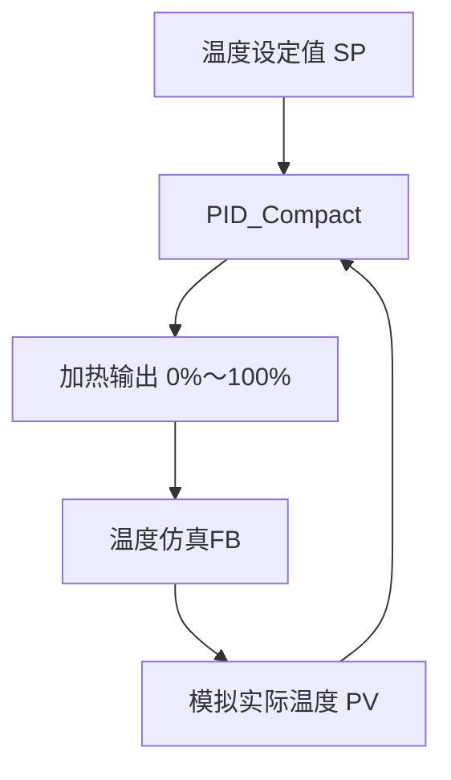

## 一、项目目标

本项目使用西门子S7-1500与PLCSIM进行仿真，通过PID_Compact控制模拟房间温度。

## 二、控制需求

本项目不连接实体温度传感器和加热器，全部通过PLCSIM完成仿真。

控制要求如下：

1. 温度设定值可由用户调整，练习时设置为55.0 ℃。
2. PID_Compact根据设定温度与实际温度的偏差计算加热输出。
3. PID输出范围为0%～100%。
4. 单独建立温度仿真FB，模拟加热升温和向环境散热的过程。
5. 将仿真温度反馈给PID_Compact，构成完整闭环。
6. PID_Compact在100 ms循环中断OB中周期调用。
7. 使用监控表观察设定温度、实际温度、PID输出和运行状态。
8. PLC程序全部使用LAD梯形图编写。

## 三、程序总体结构

本项目由两个核心部分组成：

- **PID控制器**：根据设定温度与实际温度的偏差，计算加热输出。
- **温度仿真对象**：根据加热输出和环境散热，计算下一时刻的模拟温度。

整体闭环关系如下：

程序的运行顺序为：

1. PID_Compact读取设定温度和当前模拟温度。
2. PID_Compact计算本周期的加热输出。
3. 温度仿真FB根据加热输出计算升温量。
4. 温度仿真FB同时计算房间向环境散失的热量。
5. 得到新的模拟温度，并在下一个周期反馈给PID。
6. 上述过程每100 ms重复一次，最终使实际温度稳定在设定值附近。

这就是本项目最核心的闭环逻辑：

**温度偏差 → PID计算 → 加热输出 → 温度变化 → 温度反馈**

## 四、变量规划

本项目使用全局数据块 `DB_TempControl` 集中保存PID控制、温度模型及诊断数据。

### 4.1 DB_TempControl变量

| 变量名称            | 数据类型 | 中文说明                   |
| ------------------- | -------- | -------------------------- |
| `SystemEnable`      | Bool     | 系统运行允许               |
| `Setpoint`          | Real     | PID温度设定值              |
| `ActTemp`           | Real     | 温控房模拟实际温度         |
| `HeatOutput`        | Real     | PID计算出的加热输出百分比  |
| `ManualEnable`      | Bool     | PID手动模式使能            |
| `ManualValue`       | Real     | 手动加热输出百分比         |
| `AmbientTemp`       | Real     | 外部环境温度               |
| `ProcessGain`       | Real     | 加热器满功率时的最大温升   |
| `TimeConstant`      | Real     | 温控房温度变化时间常数     |
| `CycleTime`         | Real     | 温度模型计算周期           |
| `PIDState`          | Int      | PID当前运行状态            |
| `PIDError`          | Bool     | PID活动故障标志            |
| `PIDErrorBits`      | DWord    | PID诊断代码                |
| `AppliedHeatOutput` | Real     | 温度模型实际采用的加热输出 |
| `TargetTemp`        | Real     | 当前加热输出对应的目标温度 |
| `TempDifference`    | Real     | 目标温度与实际温度之差     |
| `TempChange`        | Real     | 本周期的温度变化量         |
| `PIDMode`           | Int      | PID请求运行模式            |
| `PIDModeActivate`   | Bool     | PID模式切换触发信号        |

曾经建立的 `OB30Count` 没有编写累加程序，数值始终为0，因此不属于闭环控制的必要变量，可以删除。

### 4.2 FB_TemperatureModel接口

温度仿真功能块名称为 `FB_TemperatureModel`，调用时生成实例数据块 `DB_TemperatureModel`。

| 接口区域 | 变量名称            | 数据类型 | 中文说明                     |
| -------- | ------------------- | -------- | ---------------------------- |
| Input    | `Enable`            | Bool     | 温控房模型运行允许           |
| Input    | `HeatInput`         | Real     | PID输出的加热功率百分比      |
| Input    | `AmbientTemp`       | Real     | 温控房外部环境温度           |
| Input    | `ProcessGain`       | Real     | 加热器满功率时的最大温升     |
| Input    | `TimeConstant`      | Real     | 温控房温度变化时间常数       |
| Input    | `CycleTime`         | Real     | 温度模型计算周期             |
| InOut    | `ActualTemp`        | Real     | 读取并更新温控房实际温度     |
| Output   | `AppliedHeatOutput` | Real     | 经过限制后实际采用的加热输出 |
| Output   | `TargetTemp`        | Real     | 根据加热输出计算的目标温度   |
| Output   | `TempDifference`    | Real     | 目标温度与实际温度之差       |
| Output   | `TempChange`        | Real     | 当前周期的温度变化量         |
| Temp     | `HeatRise`          | Real     | 加热功率产生的温升中间值     |

## 五、温度对象仿真FB

## 六、PID_Compact控制程序

## 七、仿真与调试过程

## 八、遇到的问题及解决方法

## 九、项目总结
